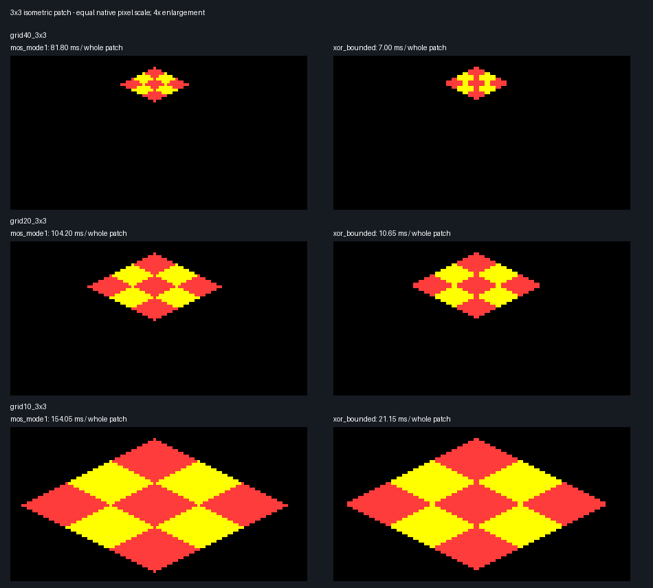

# One XOR sweep over a 3×3 isometric checkerboard

**Batching adjacent cells does help substantially.** At Landscape's current
40-grid scale, the whole nine-cell patch takes **81.80 ms with MOS PLOT 85**,
**40.40 ms with the original full-window XOR sweep**, or **7.00 ms with a sweep
restricted to the patch**. The bounded version is 11.7× faster than MOS here.
Unlike the single-triangle experiment, even the unchanged full-window clear/fill
now wins: its cost is paid once for all nine cells.

This is a separate experiment; Landscape remains unchanged. It uses the same
upstream revision and Beebium environment as the [triangle experiment](README.md).
The exact geometry, measurements and colour counts are in
[patch-results.json](patch-results.json).

## Test geometry and rendering

Nine touching rhombi form a flat 3×3 isometric patch, alternating logical
colour 1 (red) and 2 (yellow): five red cells and four yellow. The grid-to-screen
mapping in native pixels is:

```
x = 80 + (i-j)*step
y = 80 + (i+j)*step/2
```

The tests use `step=4,8,16`, matching flat Landscape cells at grid sizes 40, 20
and 10. Each cell spans `2*step` horizontally and `step` vertically. The whole
patch spans `6*step` by `3*step`. All images and comparisons use equal native
pixel dimensions, with the MODE 5 X coordinates scaled appropriately.

**MOS:** nine GCOL changes, 18 filled triangles. Each cell sends two MOVE
commands followed by two PLOT 85 commands, reusing the diagonal endpoints for
the second triangle. This is 36 PLOT commands plus nine GCOL commands, delivered
from an assembly loop through OSWRCH. It avoids BASIC interpreter overhead.

**Batched XOR:** clear the scratch region once, draw the colour transitions,
then sweep once. There are no internal triangle diagonals. The patch has
12 outer edges and 12 shared edges, so only **24 edge calls** are needed.
Outer edges carry their cell's colour; every internal red/yellow edge carries
`1 XOR 2 = 3`. The accumulated colour changes between red and yellow when the
sweep crosses it; white is not a visible cell colour.

**Unmerged XOR control:** draw all four edges of all nine quadrilaterals
(**36 calls**), still followed by only one bounded sweep. Shared edges are
submitted in the same canonical direction, once in each neighbouring colour.
Their XOR writes combine into the same transition as the merged edge table.
This gives exactly the same final image and measures the effect of removing
those 12 duplicate edge traversals separately from sharing the fill pass.

The sweep works on four packed pixels at once. It carries their accumulated
colours down the byte column, allowing one byte to contain pixels from different
cells. It neither fills the two triangles separately nor revisits the same
byte separately for each cell.

## Measurements

**Milliseconds per complete nine-cell patch**, averaged over 200 repetitions.
Beebium Model B, nominal 2 MHz, MOS 1.20. Timed with BBC `TIME`, including normal
interrupts; the timer quantum per averaged result is 0.05 ms. These are one run
per scale, not statistical confidence intervals.

| Grid scale / patch span | MOS MODE 1 | MOS MODE 5 | XOR original window, 24 edges | XOR bounded, 24 edges | XOR bounded, 36 edges | Bounded speedup vs MODE 1 |
|---|---:|---:|---:|---:|---:|---:|
| 40 / 24×12 | 81.80 | 82.35 | 40.40 | **7.00** | 9.95 | **11.7×** |
| 20 / 48×24 | 104.20 | 104.85 | 42.15 | **10.65** | 14.50 | **9.8×** |
| 10 / 96×48 | 154.05 | 154.95 | 45.65 | **21.15** | 26.75 | **7.3×** |

At the current scale, batching without shared-edge merging already gives an
8.2× improvement (81.80 / 9.95). Combining shared edges then saves another
2.95 ms per patch. The original-window version is 2.0× faster than MOS at this
scale, increasing to 3.4× for the largest patch.

The bounded sweep clears/fills 105, 351 and 1,275 bytes respectively, including
byte alignment and guard scanlines. The original window clears 4,608 bytes and
fills 4,584 bytes, regardless of patch size.

Timing includes the assembly repetition loops, command/edge table traversal,
MOS colour changes, XOR buffer clearing, every boundary edge and the entire
fill pass. Screen MODE changes, initial display clearing, disk loading and
host verification are outside the timer. Geometry and edge topology are
precomputed for both paths. XOR bounds/address sequences and shared-edge colour
merging are also precomputed, so dynamic setup costs are not measured. BASIC
only launches/times the assembly loops.

The packet-based MOS driver differs from the literal unrolled command stream
in the original single-triangle test. Compare the methods within this patch
experiment rather than interpreting differences between the two harnesses as
precise batching costs.

## Visual checks



The runner verifies:

- Identical native-pixel MOS output between MODE 1 and MODE 5.
- Identical XOR output across the original window, bounded sweep and unmerged
  edge control.
- Correct red/yellow colour at every cell centre and no other visible colours.
- No black holes within any occupied scanline of the convex patch.
- Exact expected XOR areas: each cell has `step²` pixels, giving five cells'
  worth of red and four cells' worth of yellow.

| Patch | MOS coloured pixels | XOR coloured pixels | XOR red / yellow |
|---|---:|---:|---:|
| Grid 40 | 157 | 144 | 80 / 64 |
| Grid 20 | 601 | 576 | 320 / 256 |
| Grid 10 | 2,353 | 2,304 | 1,280 / 1,024 |

MOS still has different boundary inclusion/rounding, including which colour
owns shared boundary pixels. It therefore does not match XOR pixel for pixel.
The coverage difference is much smaller for a patch than for one tiny triangle.
The enlarged images show the resulting differences, particularly at grid 40.

## What this establishes for Landscape

For a flat connected patch, the single-triangle benchmark understated the
benefit of this technique. Shared colour boundaries and one fill pass are a
natural match for this geometry, and the test demonstrates that they work
across byte boundaries without seams or stray colours.

This is still not a whole-Landscape timing estimate. A general MODE 1 renderer
would need adapted addressing, runtime geometry and bounds, and a plan for
retaining pixels outside the patch. The bounding-box implementation here writes
black outside the patch within that box. More importantly, hills can cause
true projected overlaps between non-neighbouring faces: those need visibility
handling before an XOR sweep. Merely sharing edges in a flat tiling solves a
different problem from deciding which overlapping terrain surface is visible.

## Reproduce

Use the Python environment and pinned upstream checkout described in the
[original README](README.md), then run from the Landscape root:

```sh
python experiments/triangle-bench/patch_benchmark.py --upstream /tmp/bbc-micro-3d-review
```

Default: all three sizes, 200 repetitions each. For a quick run:

```sh
python experiments/triangle-bench/patch_benchmark.py --upstream /tmp/bbc-micro-3d-review --step 4 --repeats 20 --output .beebium-test/patch-smoke
```

`--server`, `--rom-dir` and `--assembler` override tool locations. Generated
assembly, BASIC, SSDs, RAM captures, individual images, comparison image and
JSON go to `.beebium-test/patch-bench/` by default. As with the original test,
the SSDs use the runner's host handshake to pause between measurements.
