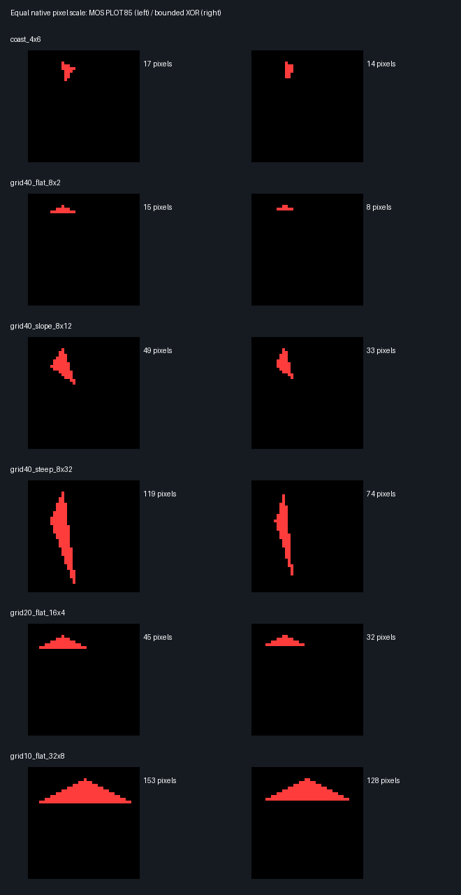

# Triangle rendering experiment

**Follow-up:** the [3×3 checkerboard patch experiment](PATCH.md) tests one sweep
over nine touching red/yellow quadrilaterals. Batching changes the conclusion:
even the original full-window XOR path beats MOS for that patch.

The original BBC Micro 3D renderer is **not a direct substitute for PLOT 85**.
Its specialised MODE 5 edge routine is fast, but draws XOR transitions rather
than complete triangles. A separate pass integrates those transitions vertically
across a rectangular window. Filling the original window after every small
triangle is slower than MOS; restricting that operation to a triangle's box is
promising, subject to the limitations below.

Landscape itself has not been modified. This experiment generates separate SSDs.

## Source reviewed

[bbc-micro-3d](https://github.com/simondotm/bbc-micro-3d/tree/d7f03fe69a3f892440e985f063444492a4702a29),
revision `d7f03fe69a3f892440e985f063444492a4702a29`, by Nick Jameson,
ported and annotated by Simon M. Sources are fetched separately, not vendored.

- [linedraw5f.asm](https://github.com/simondotm/bbc-micro-3d/blob/d7f03fe69a3f892440e985f063444492a4702a29/source/linedraw5f.asm):
  specialised Bresenham edge generation, unrolled for four pixels per byte,
  self-modifying immediate operands, colour masks and XOR writes. It halves its
  input X coordinates and excludes the right endpoint. It emits the transitions
  needed by a vertical fill, rather than a conventional outline.
- [renderer.asm](https://github.com/simondotm/bbc-micro-3d/blob/d7f03fe69a3f892440e985f063444492a4702a29/source/renderer.asm):
  clears a scratch buffer, draws visible edges, then uses an unrolled vertical
  XOR pass to write the display buffer. The solid demo's fixed window is
  **96×192 physical pixels** (4,608 bytes); the fill leaves its first row alone.
  Its cost is normally paid once per object/frame, not once per triangle.
- The surrounding 3D code caches projected vertices, uses table-driven
  transforms and quarter-square multiplication, and exploits previous-frame
  visibility and opposite faces for culling. These mostly address rotating
  closed models; they are not the central costs in Landscape's static isometric
  projection. This experiment isolates rasterisation, with no 3D transforms.

## Equal pixel sizes

MODE 1 and MODE 5 both pack four 2-bit pixels into one byte, with the same bit
layout. MODE 1 is 320×256; MODE 5 is 160×256. An X distance in BBC graphics units
therefore needs doubling in MODE 5 to cover the same number of native pixels.
Y units remain unchanged. The benchmark uses `x*4` for MODE 1, `x*8` for MODE 5,
and `(255-y)*4` for both, where its own Y coordinates increase downwards.

The row strides differ (640 versus 320 bytes per eight scanlines), so equal
coverage is not a guarantee of precisely equal timings. Measured MOS timings
here differ by less than 1.2%. Pixel comparisons confirm identical MODE 1/MODE 5
MOS output at native pixel scale.

Landscape sets `hscale = 320 DIV gridsize`. A grid-axis step is `2*hscale`
graphics units horizontally and `hscale` vertically. At grid size 40 this is
4×2 pixels: one flat half-cell triangle has an **8×2 pixel bounding span** and
the whole cell diamond spans 8×4. The flat 20- and 10-grid examples follow the
same calculation. Slopes and shoreline intersections change those dimensions.

These are **six synthetic examples**, not a captured distribution of actual
Landscape triangles. Width/height describe differences between vertex
coordinates, not inclusive pixel counts. The slope and shoreline cases are
illustrations, not measured percentiles. All are on screen and unclipped.

## Measured results

Beebium 0.1.6, BBC Model B, MOS 1.20, nominal 2 MHz; 1,000 repetitions per case.
Times below are **milliseconds per triangle**, derived from BBC `TIME`, not host
wall-clock speed. Raw measurements and vertices are in [results.json](results.json).
The clock's 10 ms resolution gives a 0.01 ms per-triangle quantum for these runs;
interrupts remain enabled. These are single-run measurements, not confidence intervals.

| Triangle span | MOS MODE 1 | MOS MODE 5 | Original XOR window | Bounded XOR | BASIC MODE 1 |
|---|---:|---:|---:|---:|---:|
| Shoreline 4×6 | 6.64 | 6.70 | 35.03 | 0.86 | 10.62 |
| Grid 40 flat 8×2 | 5.20 | 5.25 | 35.01 | 0.85 | 9.18 |
| Grid 40 slope 8×12 | 9.93 | 10.00 | 35.26 | 1.31 | 13.91 |
| Grid 40 steep 8×32 | 18.76 | 18.90 | 35.49 | 1.98 | 22.73 |
| Grid 20 flat 16×4 | 6.45 | 6.50 | 35.21 | 1.23 | 10.42 |
| Grid 10 flat 32×8 | 9.21 | 9.28 | 35.64 | 2.18 | 13.20 |

The bounded experiment is **4.2–9.5× faster** than the assembly-driven MODE 1
MOS baseline on these inputs. This is a rasterisation microbenchmark, not a
predicted Landscape speedup.

### Exactly what is timed

- **MOS**: an assembly loop sends `PLOT 4`, `PLOT 4`, `PLOT 85` through OSWRCH.
  This matches Landscape's assembly-to-MOS interface; the interpreter is absent.
  Coordinates are precomputed, GCOL is set outside the timer, and loop/call costs
  are included. Landscape sometimes reuses previous vertices between triangles,
  so this independent-triangle baseline is not its exact command stream.
- **Original XOR window**: the upstream `wipe`, three calls to the unchanged
  upstream `linedraw5f`, then the upstream `fill`. No transform/culling work.
- **Bounded XOR**: the same three edge calls, with clear/fill restricted to a
  byte-aligned box with one guard scanline above and below. The vertical XOR
  operations use the same approach, generated for that case's Y range; the X
  loop processes four pixels at a time. **Bounds and addresses are specialised
  at build time**; a general implementation would need setup and addressing work.
- **BASIC**: a literal BASIC loop executing the same three PLOT commands in MODE 1,
  with literal, precomputed coordinates. This additional baseline includes the
  interpreter and BASIC loop overhead; it is not the current Landscape path.

MODE changes, screen clearing by MODE, disk loading, GCOL, host screenshots and
pixel verification are outside the measured intervals. XOR scratch clearing
and the complete fill pass are inside. Each method repeatedly renders the same
triangle, in colour 1, onto a black display. This is not a batching benchmark.

### Correctness and integration limits

The runner checks all of the following, pixel for pixel:

- MOS MODE 1 and MODE 5 match at native pixel scale.
- BASIC and assembly-driven MOS match.
- The bounded XOR result matches the original full-window XOR result.
- Every method draws nonzero pixels.

**MOS and XOR do not match each other.** Their edge inclusion and rounding rules
differ. For the flat 8×2 case MOS draws 15 pixels and XOR draws 8; for 8×12 they
draw 49 and 33. Equal input geometry and bit depth therefore do not mean equal
numbers of final coloured pixels. The comparison image makes this visible;
both columns use equal native pixel scaling (MODE 5 is not stretched here).



The bounded filler overwrites its entire byte-aligned box, including zero
pixels outside the triangle. It would erase neighbouring terrain if inserted
as-is. Preserving an existing scene, handling colour 0, clipping, general
coordinates and edge ownership would require additional design and measurement.
The original method can amortise its fill over many compatible visible faces,
but XOR accumulation is not painter's-order opaque overdraw: arbitrarily
batching overlapping Landscape triangles would give wrong visibility/colours.
A MODE 1 adaptation also needs different address strides and a wider X range;
packing similarity alone does not make its address code reusable unchanged.

A useful next implementation experiment would be a general opaque triangle
filler that writes horizontal spans directly, benchmarked against the same MOS
harness and actual captured Landscape geometry. The existing upstream XOR code
establishes that substantial rasterisation savings are plausible, but does not
yet establish the speed or correctness of that replacement.

## Reproduce

Needs BeebAsm on PATH and an isolated Python environment containing `beebium`,
`beebium-server`, Pillow, and `grpcio>=1.76`. The existing project Beebium test
environment can be reused. Run from the Landscape root:

```sh
git clone https://github.com/simondotm/bbc-micro-3d.git /tmp/bbc-micro-3d-review
git -C /tmp/bbc-micro-3d-review checkout d7f03fe69a3f892440e985f063444492a4702a29
python experiments/triangle-bench/benchmark.py --upstream /tmp/bbc-micro-3d-review
```

The runner checks the revision. Use `--case grid40_flat_8x2 --repeats 100` for a
quick smoke run, or `--output PATH` to keep runs separate. `--server`, `--rom-dir`
and `--assembler` allow local installation overrides. Beebium uses a localhost
connection, so a sandbox may require permission to launch it.

Generated assembly, BASIC, SSDs, raw screen RAM, PNGs and JSON go under the ignored
`.beebium-test/triangle-bench/` directory. The SSDs use a host handshake after each
measurement so the runner can inspect the output; they are intended to run through
this script rather than unattended in an interactive emulator. The versioned
results and comparison image alongside this README record the initial 1,000-repeat
run. Upstream source is copied only into the ignored build directory.
